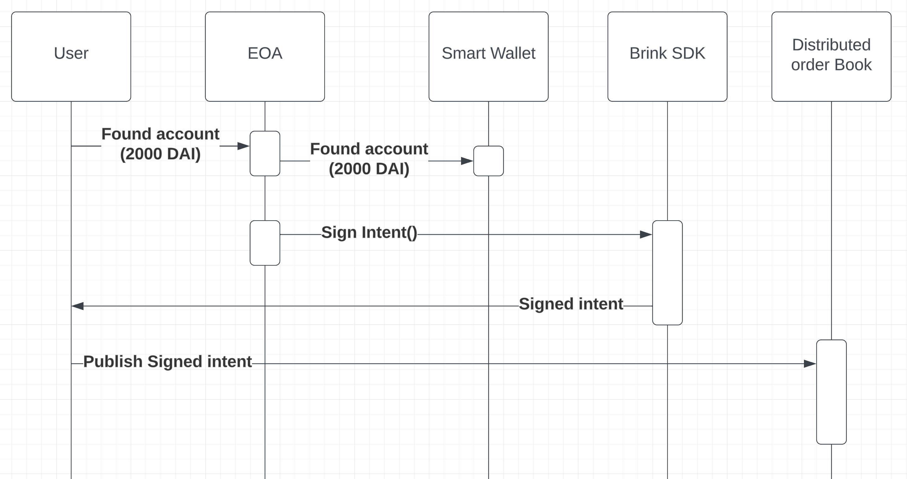
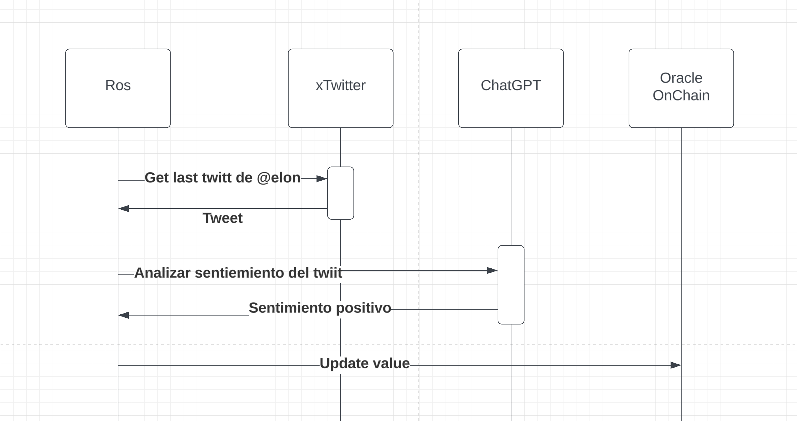
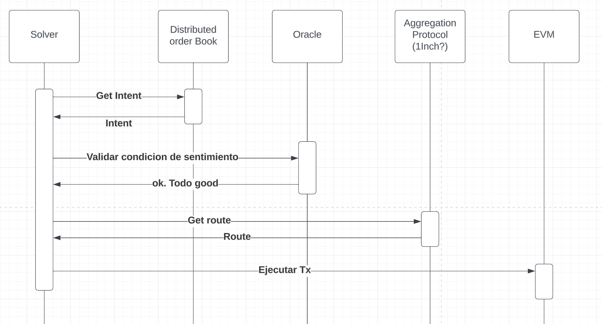

# Intenciones off-chain
Es una plataforma de trading, que ayuda a web3 users y traders a maximizar las ganancias cuidando su tiempo mediante la creación de ordenes  al detectar eventos offchain.

A continuación se explica el funcionamiento de los actores y componentes de la plataforma.
## Flujo de ususario
Un usuario tienen intencion de cambiar DAI por Dodge, cuando @elonmusk realiza un twitt con sentimiento positvo sobre Dodge Coin.

-  El usuario fondea su smart wallet. De esta wallet se van a utilzar los fondos para la orden condicional.

- El usuario firma un mensaje utilinzado [Brink](https://brink.trade), que representa su intencion: 
    - Realizar un market swap en uni de DAI > Dodge. 
    - 1% de los DODGE se transfiere al Solver que ejecute. (Esto es un ejemplo)
    - Elon tiene que haber twitteado con sentimiento positivo.
    - Valido por 1 semana.
- Se distribuye la orden.

- Se 
## Flujo de Robot de Sentimientos (ROS)
Este robot se encarga de manterner actualizado los oraculos que se utilzan en los intents de los usuarios.

- El bot obtiene los twitts de @elonmusk.
- Se envia el twitt de @elonmusk a ChatGPT para analizar sus sentimientos. 
- Si el sentimiento del twitt es positivo, se actualiza un oracle onChain.

## Flujo de Solver
El solver es una aplicación encargada de validar las condiciones establecidas por el usuario, encontrar una forma costo/efectiva de ejecutar el swap.

- Se obtien un Intent que no fue ejecutado de un libro de ordenes.
- Se validan las condiciones del swap. Que sea un periodod valido, que el user tenga fondos, que exista un posible swap route, etc. Además se valida la condicion del evento offchain. En este ejemplo, ROS ya actualizo el Oracle y se cumplen las condiciones
- Se obtine la mejor ruta para realizar el swap en UNI, en la que el usuario y Solver reciben más DODGE.
- El Solver envia la transacción para ser ejecutada.

